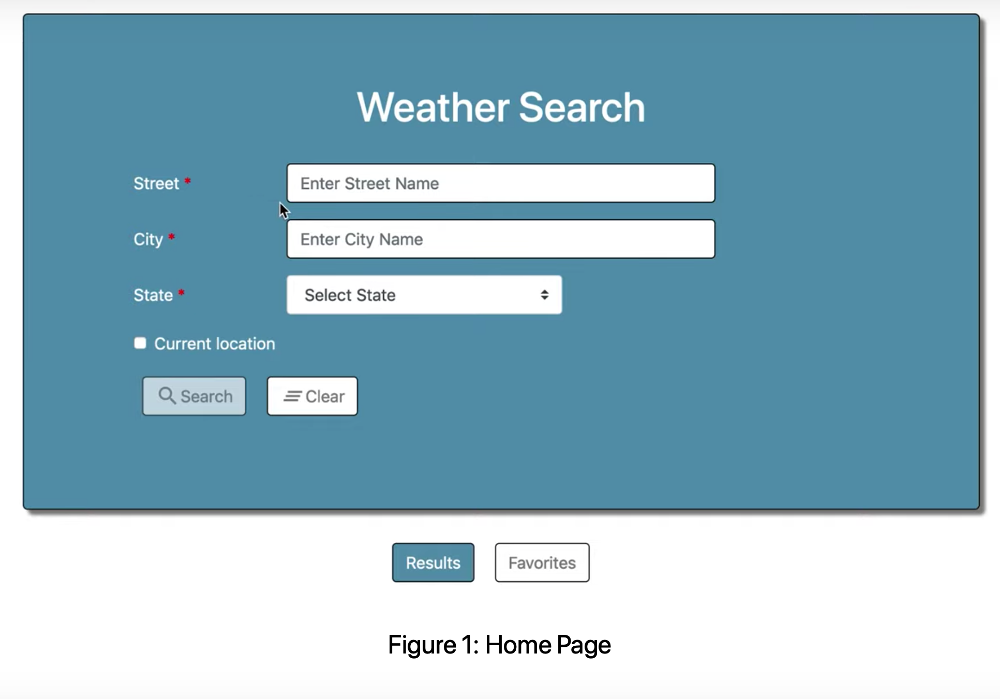
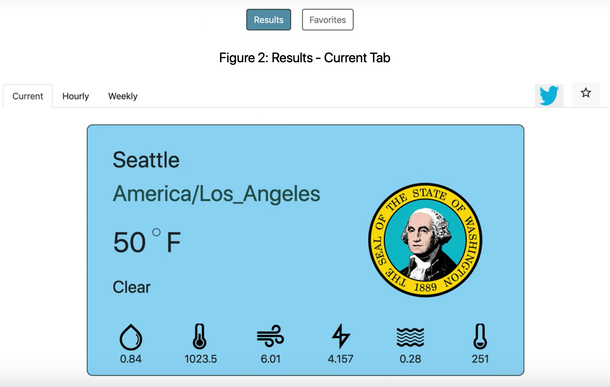

# Angular-Node-Weather-App

### Tech Stack Used:
* Front-end: Angular, HTML, CSS, BootStrap, JavaScript
* Backend: NodeJS, Typescript

## Application Documentation
https://github.com/leshwar/Angular-Node-Weather-App/blob/master/Angular-Node-Weather-App-Demo-Description.pdf

## Application Screenshots

 

## Application Demo
https://www.youtube.com/watch?v=FVUoo_WO_Ho

https://www.youtube.com/watch?v=1LnX7_5y-ds&t=2s

